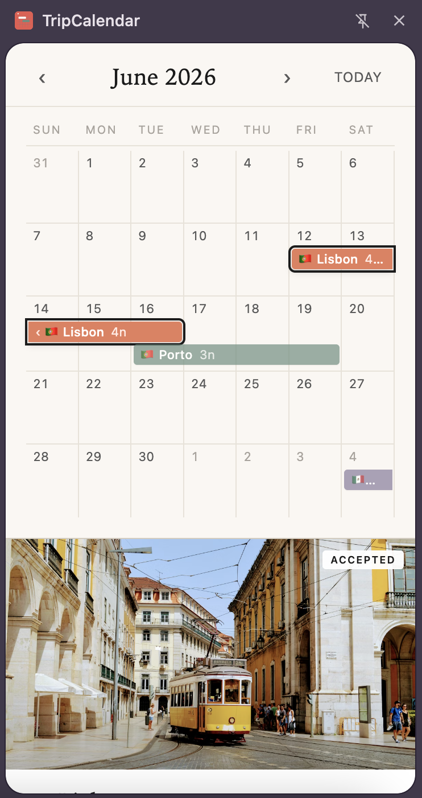
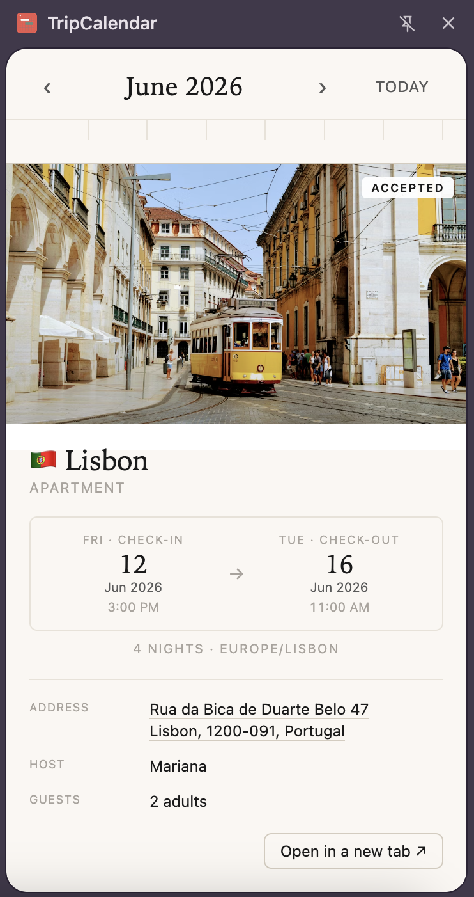
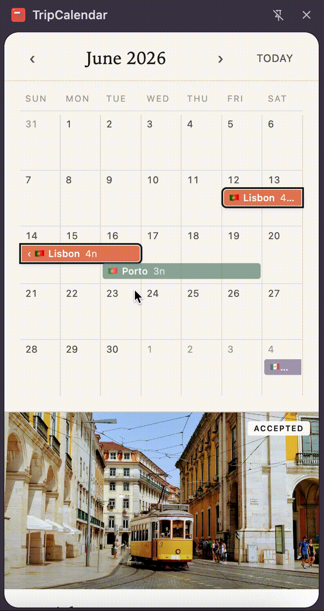

# TripCalendar

A Chrome extension that adds a month calendar view to your upcoming travel. Built for the Airbnb trips page, where stays are listed but not visualized on a date grid.

<table>
  <tr>
    <td></td>
    <td></td>
    <td></td>
  </tr>
</table>

## Why this exists

Trips are usually shown as a list — one stay, then the next, then the next. That's fine for a single trip, but if you have several spread across a few months, it's hard to see the **shape** of your travel: which dates are booked, where the overlaps are, when you have gaps to fill.

A month calendar solves this in a glance. TripCalendar adds one as a side panel, reading the same trip data the trips page already shows you. No new account, no syncing, no manual entry — open the panel and your trips are there.

## What it does

- **Month calendar** with horizontal bars for each upcoming stay
- **Stacking** — back-to-back trips that share a checkout/check-in day stack on separate rows so both are visible
- **Cross-month continuation** with chevron indicators when a trip spans the month boundary
- **Today indicator** highlighting the current date
- **Click any trip** to see details below the calendar: hero photo, dates in the destination's timezone, address (linked to Google Maps), host, property type
- **Pending bookings** rendered with a dashed pattern so you can tell them apart from confirmed ones
- **Country flags** for quick visual scanning at a glance

## Install

This is currently distributed as an unpacked extension.

1. Clone this repo or download the `src/` folder
2. Open `chrome://extensions` and turn on **Developer mode** (top right)
3. Click **Load unpacked** and select the `src/` folder
4. Pin the extension to your toolbar (puzzle icon → pin TripCalendar)
5. Open `airbnb.com` in a tab and sign in
6. Click the TripCalendar icon — the side panel will open

The side panel finds an open `airbnb.com` tab in the background to read your trip data. If you don't have one open, you'll see a prompt asking you to open one.

## How it works

TripCalendar runs a content script on `airbnb.com` so it has access to your existing session. It reads your trip data the same way the trips page does, then renders it on a CSS-grid month view.

No data leaves your machine. The only network calls it makes are to `airbnb.com` itself, using your existing browser session.

## Privacy

- No analytics, no telemetry, no tracking
- No external servers; the only network calls are to `airbnb.com`
- No data persisted outside the session

## Future work

- Past trips (currently shows upcoming only)
- Custom date range views beyond month-by-month
- Calendar export to `.ics`

## Disclaimer

TripCalendar is an independent personal project. It is not affiliated with, endorsed by, or sponsored by Airbnb, Inc. "Airbnb" is a trademark of Airbnb, Inc. and is used here only to describe the service this extension reads from.

## License

[MIT](LICENSE)